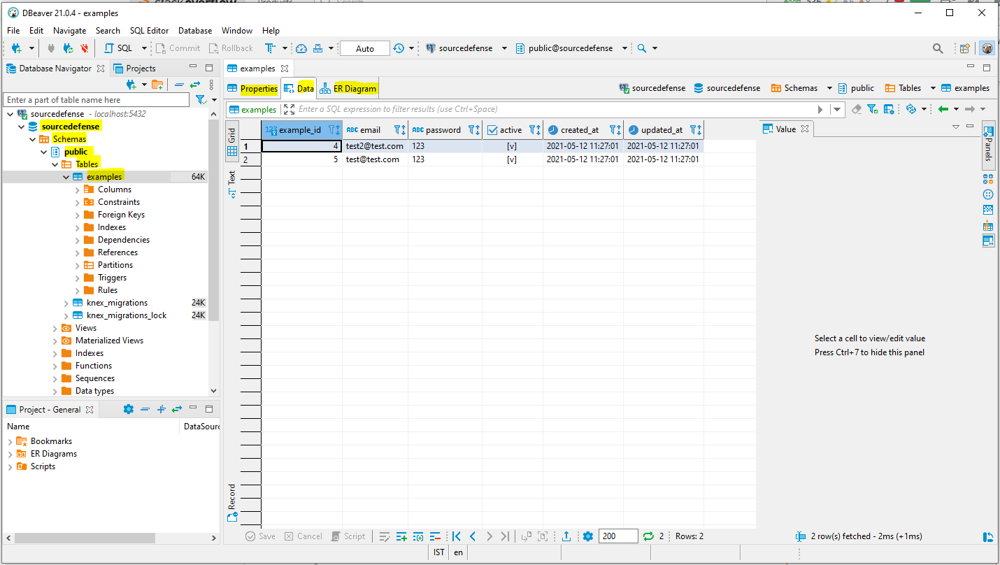

# Install and Running

1. First run `npm install` .<br>
<br>
2. Install some UI for postgreSQL db service, for example: [DBeaver](https://dbeaver.io/download/) .<br>
<br>
3. Create a don env file: `.env`
    ``` 
    DB_HOST=localhost
    DB_DB=sourcedefense
    DB_USER=sourcedefense
    DB_PW=sourcedefense
    ```
   <br>
   
4. Run `npm run start:db` for running the postgres service on your computer with docker-compose up. <br>
<br>
   
5. Running migrations <br>
5.1 Run `npm run migrate:up` for running the initial migration that make your first table <br>
see it in `./migration/20210511083844_example.js` file. <br>
5.2 Run `npm run migrate:down` for running the migration rollback for the previous last batch. <br>
<br>
   
6. then run the DBeaver program, and then make connection to your db, select PostgreSQL db. <br> 
   Fill the fields: `Host, Database, Username, Password`
   and press `Test connection` button to get the following result. <br>
   <br>
    <br>
   Finally press `Finish` button. <br>
   <br>
   
7. Run `npm run start:dev` for running insert data to table by transaction as have been written in file: `index.js` .<br>
More info about [knwex](http://knexjs.org/)
<br>

8. Then go to: <db-name (sourcedefense)> -> Schemas -> public -> Tables -> examples
   you will see 3 tabs: Properties, Data, ER Diagram
     <br>
